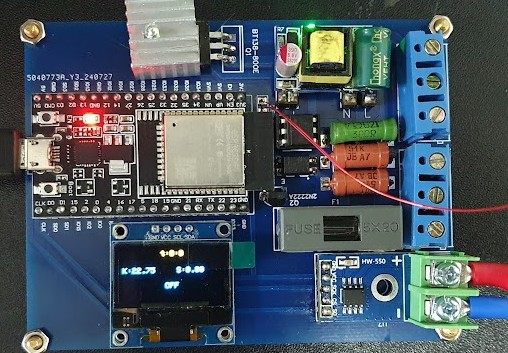

<h1>Temerature controller on ESP32 using MAX6675</h1>

<h2>Hardware</h2>

This project utilizes the following hardware components:

<ul>
    <li><code>ESP32 DevKitC V4</code> <a href="https://docs.espressif.com/projects/esp-idf/en/release-v4.2/esp32/hw-reference/esp32/get-started-devkitc.html">link for more info</a></li>
    <li>MAX6675 thermocouple module</li>
    <li>SSD1306 OLED display</li>
    <li>Optocoupler with TRIAC for thermal reactor control connected to 220VAC</li>
    <li>Zero cross detector circuit on the same PCB for phase detection and PWM control of reactor power</li>
</ul>
<!--  add image Images/PCB.jpg and align to center with image size height= 10px-->

    

<h2>Software</h2>

This project utilizes the following software components:

<ul>
    <li>FreeRTOS for task scheduling and management</li>
    <li>Web interface created for ESP32 displaying real-time graphs</li>
    <li>Printing temperature and time values in a table</li>
    <li>Allowing the setting of PID constants for PWM signal</li>
</ul>

<h2>Code</h2>

The actual code can be found in folder <code>v.0.1</code>, under <a href="/Software/freeWebServer/">MCUCod</a>.

<h2>Circuit and PCB Design</h2>

The circuit and PCB design can be found on EasyEDA:

<a href="https://oshwlab.com/creciunelcatalin/controlul-temperaturii">EasyEDA - Circuit and PCB</a>

<h2>Additional Notes</h2>

This project also features an application for use via USB from a PC or Bluetooth, providing versatile control options.

The circuit design takes into account the form and size of the case for practical implementation.

